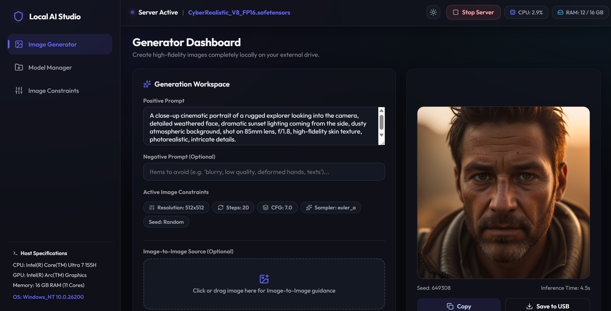
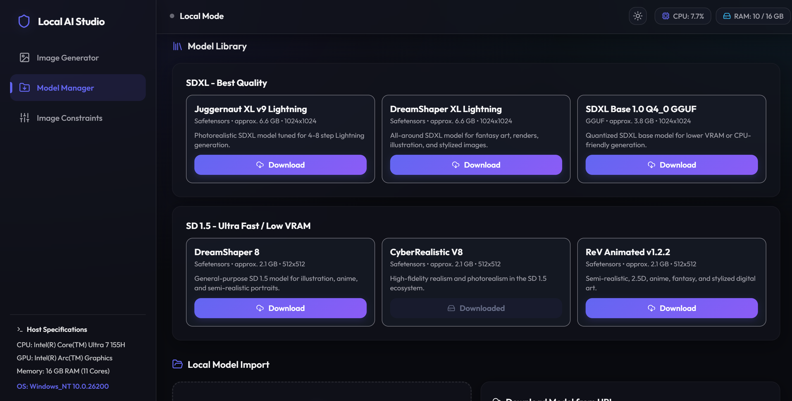
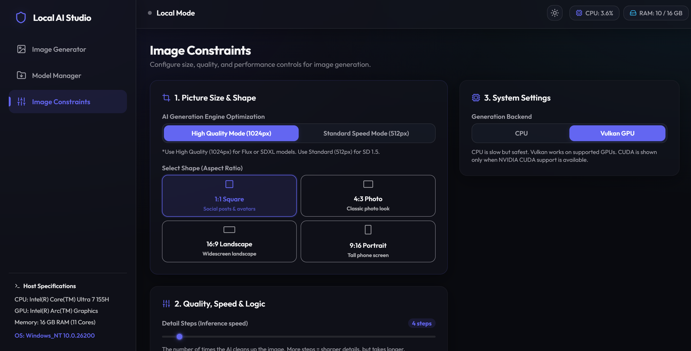

# SD-Ai · 离线 AI 图像生成器

> 完全离线、AI 画图工具箱 —— Android 手机 + Windows PC 都能跑


## 这是什么

SD-Ai 是一个**完全离线**的 AI 图像生成工具，特点是：

- **双端协同**：Android 手机 App + Windows PC 后端，局域网联机
- **隐私安全**：所有图片在本地生成，不上传任何服务器
- **模型丰富**：支持 SD 1.5 全部生态（safetensors / 预转 MNN）
- **硬件友好**：高通 NPU 加速、CPU 4 线程、CUDA / Vulkan 显卡加速

适合：玩 Stable Diffusion 但不想折腾 Python / 不想上云 / 想在手机上画图的人。

## 项目结构

```
SD-Ai/
├── android-app/      # Android 客户端源码（Kotlin + Jetpack Compose）
├── pc-backend/       # PC 后端：serve.cjs + start.bat + 一键部署脚本
├── assets/           # 截图资源
├── docs/             # 开发文档、模型下载指南
├── README.md         # 本文件
├── LICENSE
└── .gitignore
```

## 快速开始

### 手机端（Android App）
1. 用 Android Studio 打开 `android-app/`
2. 编译 `assembleDebug` 生成 APK
3. 安装到手机
4. 启动后即可在本地画图（无网络）

### PC 端（可选，加速用）
1. 安装 Node.js（v18+）
2. 启动 `pc-backend/start.bat`
3. 浏览器或手机 App 输入 `http://PC-IP:1420` 连接
4. 选模型 → 加载 → 在手机上点生成

> 模型需要单独下载（6GB+），见 `docs/模型下载地址清单.md`

## 主要特性

- ✨ 文生图、图生图（支持 CLIP Skip 切换）
- 🎨 多种采样器（Euler / DPM++ / LCM 等）
- 📐 自定义分辨率（256×256 ~ 1024×1024 + 自定义）
- 🔄 In-app 模型转换（`.safetensors` → MNN，手机上直接转）
- 🖼️ 本地图库（按时间、参数筛选、批量删除、图生图）
- 📊 硬件监控（CPU/RAM/GPU/温度，兼容 MIUI SELinux 限制）
- 🔁 远程 PC 模式（局域网用 PC 显卡加速，5-20秒出图）
- 🌐 中文界面 + 多语言切换

## 文档

- 📱 **手机 App 开发指南**：[docs/SD-AI-移动应用开发指南.md](docs/SD-AI-移动应用开发指南.md)
- 📋 **Android 开发文档**：[docs/SD-AI-Android-开发文档_20260610.md](docs/SD-AI-Android-开发文档_20260610.md)
- 🖥️ **部署说明**：[docs/部署说明.md](docs/部署说明.md)
- 🔽 **模型下载清单**：[docs/模型下载地址清单.md](docs/模型下载地址清单.md)
- 📥 **快速下载方案**：[docs/快速下载方案.txt](docs/快速下载方案.txt)
- 🈯 **模型汉化指南**：[docs/模型下载与汉化指南.md](docs/模型下载与汉化指南.md)
- 🚀 **高级模型地址**：[docs/高级模型下载地址.md](docs/高级模型下载地址.md)
- 🖥️ **CUDA 后端**：[docs/CUDA后端手动下载指南.md](docs/CUDA后端手动下载指南.md)
- 📱 **日志监控**：[docs/手机APP日志实时监控方法.md](docs/手机APP日志实时监控方法.md)

## 截图





## 技术栈

| 模块 | 技术 |
|------|------|
| Android App | Kotlin + Jetpack Compose + Material 3 |
| 推理引擎 | MNN（FP32，CPU 4 线程 / 高通 NPU） |
| 模型格式 | 预转 MNN（xororz/local-dream 模板）+ 自研 safetensors → MNN 转换 |
| PC 后端 | Node.js + native sd-cuda/sd-vulkan (stable-diffusion.cpp) |
| 前后端通信 | Ktor HTTP Client（OpenAI 兼容 API） |

## 路线图

- [ ] NPU 加速路径（Qualcomm DSP Hexagon）
- [ ] LCM-LoRA / SDXL-Turbo 兼容
- [ ] ControlNet 集成
- [ ] PC 后端模型自动下载
- [ ] 多用户 / 队列管理

## 贡献

欢迎 PR 和 Issue。本项目基于以下开源工作：

- [xororz/local-dream](https://github.com/xororz/local-dream) - MNN 转换模板与 Android 推理参考
- [leejet/stable-diffusion.cpp](https://github.com/leejet/stable-diffusion.cpp) - PC 后端推理引擎
- [MNN](https://github.com/alibaba/MNN) - 移动端推理框架

## 许可证

本项目源代码遵循 [LICENSE](LICENSE)。模型权重另遵循各自作者的许可证（详见模型下载页）。
